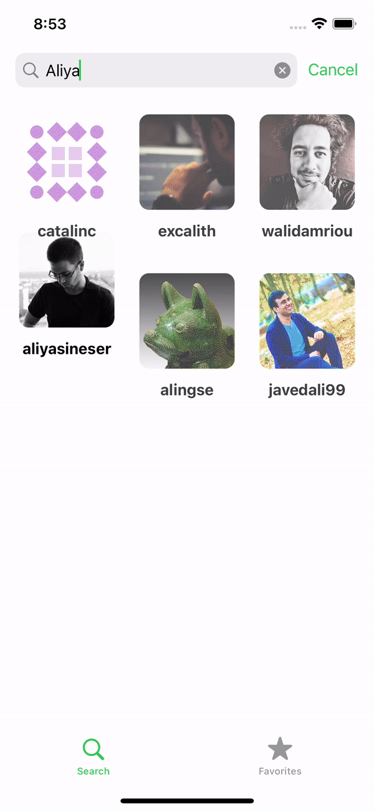
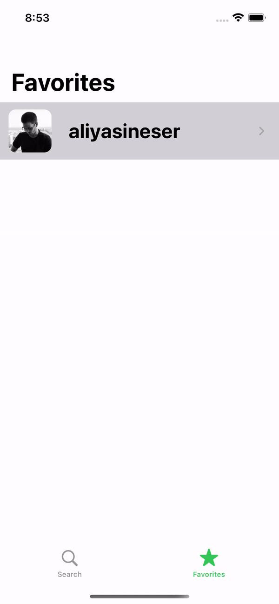

# GitHubFollowers - Course App
Course App that I work on, designed by [Sean Allen](https://github.com/SAllen0400) in his course:

[iOS Dev Job Interview Practice - Take Home Project](https://seanallen.teachable.com/p/take-home)

# Course Hightlights

- 100% Programmatic UI
- 1 project, not one-off tutorials
- No 3rd party libraries

# Features

- Search a user an access all the followers
- Access User Info 
- Add user to your favorites
- Persistence for reducing/optimizing network load

# Demo

- Load More Followers with Pagination

- Open Safari to see the user page

- Searching followers

- Add User to favorites and error handling 

- Delete User From Favorites

